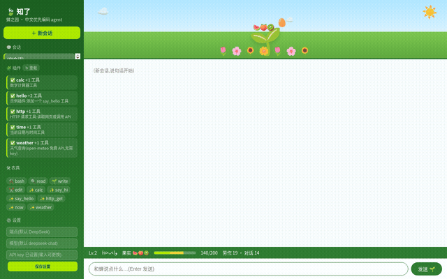

<h1 align="center">🍃 zhiliao</h1>

<p align="center">
  
</p>

<p align="center">
  <b>The Chinese-first AI coding agent that grows a garden</b><br>
  Turn coding into a farming game — every tool is a tool of the trade, every success grows a fruit 🍎
</p>

<p align="center">
  <a href="https://www.npmjs.com/package/zhiliao"></a>
  <a href="https://www.npmjs.com/package/zhiliao"></a>
  
  
  
</p>

<p align="center">
  <b>🇨🇳 Chinese-first</b> · <b>🧩 Everything is a plugin</b> · <b>🌸 Garden farming</b> · <b>⚡ Zero-dependency light</b> · <b>🏠 Local models</b>
</p>

<p align="center">
  <a href="https://github.com/mikeyang072388/zhiliao">中文版 README</a>
</p>

---

## Why zhiliao?

Most AI coding agents are cold minimal black boxes, or yet another English chat bubble. **They write your code, but they never get to know you.**

zhiliao is different. It's a **cicada that lives in your terminal**. Every time you ask it to work, it swings its hoe, plants seeds, and harvests in its little garden:

```
      ☁️        ☀️        ☁️
       🌳
    🌷🌱🌸🌻🌼
 Garden Lv.5 🦗 (๑˃ᴗ˂)ﻭ EXP ██████░░░░ 🍎🍐🍑
 ─────────────────────────────────
you> write me a sorting algorithm
⚒️ the cicada hoes the soil (bash)
🍎 harvested 🍊! (+10 EXP)
🍃 done — quicksort, O(n log n)
─────────────────────────────────
you> _
```

**You use tools, it levels up. You fail, it wilts.** The garden persists across sessions — the fruits you grow today are still there tomorrow.

## ✨ Features

| | Feature | Why it matters |
|---|---|---|
| 🌸 | **Garden farming (unique)** | Tools = farm tools. Every 5 successful calls grow a random fruit. Leveling makes the tree grow 🌱→🌿→🌳. Mood shifts — failures wilt the flowers 🥀 |
| 🧩 | **Everything is a plugin** | Drop a `.js` file into `~/.zhiliao/plugins/` and it just works — hit "↻ reload" in the web sidebar for **hot reload, no restart**. Powered by [Cordis](https://github.com/cordiverse/cordis) — the same framework behind DeepSeek Harness |
| 🇨🇳 | **Chinese-first** | Full Chinese interaction. DeepSeek / Kimi / Qwen work out of the box. Chinese paths and output, zero friction |
| ⚡ | **Ridiculously light** | Pure Node, no build chain. CLI + web UI share one core |
| 🖥️ | **Animated garden web UI** | `zhiliao web` → clouds drift, flowers sway, the cicada hops, fruits glow on the tree |
| 🏠 | **Local-model friendly** | One line to connect ollama. Your data never leaves your machine |
| 🔒 | **Keys stay local** | API key lives in `~/.zhiliao/config.json` (mode 0600). Publishing open source never leaks it |
| 💾 | **Transparent sessions** | Every turn is logged to JSONL, `--resume` continues, replay anytime |

## 🚀 30-second start

```bash
# 1. Install
npm i -g zhiliao

# 2. Configure your key once (persists forever)
zhiliao config --key sk-your-key

# 3. Go!
zhiliao "write me a binary search"
zhiliao                        # interactive garden mode
zhiliao web                    # animated garden web UI http://127.0.0.1:3939
```

Local model? `zhiliao config --base http://localhost:11434/v1 --key ""` and you're done.

## 🧩 Everything is a plugin — literally everything

**The built-in tools are themselves a plugin** (`builtin-core`) — third-party plugins share the exact same contract. No privileged access.

```bash
mkdir -p ~/.zhiliao/plugins
cp node_modules/zhiliao/examples/weather.plugin.js ~/.zhiliao/plugins/  # copy an example
# edit, save, hit "↻ reload" in the web sidebar. Done.
```

```js
// A plugin is just an object. That's it.
export default {
  name: 'my-plugin',
  apply(ctx) {
    ctx.tools.register({
      name: 'greet',
      description: 'greet a user',
      parameters: { type: 'object', properties: { name: { type: 'string' } } },
      async execute(args) { return `Hello, ${args.name}!`; },
    });
  },
};
```

Ships with 5 example plugins: `hello` / `time` / `http` / `weather` (free, no key) / `calc`. Break one? **A single failing plugin never affects anything else.**

## ⚔️ Versus the others

| | 🍃 zhiliao | Claude Code | Codex | Generic chat agent |
|---|---|---|---|---|
| Chinese-first | ✅ native | meh | meh | meh |
| Garden farming | ✅ unique | ❌ | ❌ | ❌ |
| File-drop plugins | ✅ | MCP ecosystem | plugin system | ❌ |
| Local models | ✅ one line | limited | ❌ | limited |
| Garden web UI | ✅ zero-dep | ❌ | partial | generic |
| Footprint | tiny | medium | medium | heavy |

## 🗺️ Roadmap

- [x] CLI agent loop + session persistence
- [x] Plugin system + hot reload
- [x] Garden farming (level / fruits / mood)
- [x] Web UI (sidebar / multi-session / Markdown)
- [x] SSE streaming
- [ ] Plugin marketplace (share/install community plugins)
- [ ] MCP support
- [ ] Session delete/rename
- [ ] Mobile PWA

## 🤝 Join in

zhiliao is a freshly-hatched cicada 🥚. If it made you smile, or actually helped:

- ⭐ **Star it** — that's the sunlight it needs to grow 🌱
- 🐛 Found a bug? Open an [Issue](https://github.com/mikeyang072388/zhiliao/issues)
- 🧩 Wrote a plugin? Share it in [Discussions](https://github.com/mikeyang072388/zhiliao/discussions)
- 💬 Want to chat? [Discussions](https://github.com/mikeyang072388/zhiliao/discussions)

**Stack**: TypeScript · Node · [Cordis](https://github.com/cordiverse/cordis) · ink · zero-dependency web

**License**: [MIT](LICENSE)
